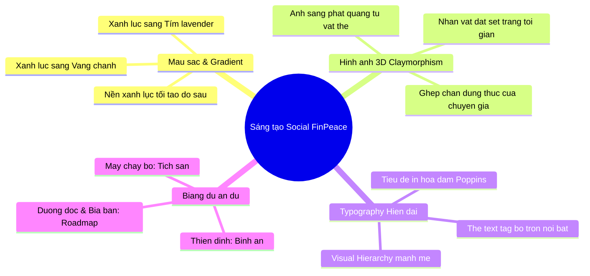

# BẢN QUY CHUẨN & ĐỊNH HƯỚNG SÁNG TẠO THIẾT KẾ FINPEACE
*(FinPeace Ultimate Design Insights & Brand Standards)*

Tài liệu này tổng hợp toàn bộ quy chuẩn nhận diện cốt lõi của thương hiệu **FinPeace** từ tài liệu chính thức cùng các phân tích mở rộng từ hệ thống hình ảnh minh họa mới nhất. Đây là cẩm nang hướng dẫn giúp đội ngũ sáng tạo linh hoạt thiết kế cho cả hai mảng: **Ấn phẩm doanh nghiệp chính thống (Corporate Style)** và **Ấn phẩm truyền thông hiện đại (Social Media/Campaign Style)**.

---

## PHẦN 1: QUY CHUẨN THƯƠNG HIỆU CỐT LÕI (BRAND STANDARDS)

Đây là những quy tắc bắt buộc phải tuân thủ để giữ tính đồng nhất và uy tín của thương hiệu mẹ trên mọi phương tiện.

### 1. Ý nghĩa & Quy chuẩn Logo
- **Ý tưởng thiết kế:** Logo được tạo thành từ 2 chữ **"P"** lồng ghép vào nhau (Plan – Kế hoạch, Partner – Người bạn đồng hành), biểu trưng cho sự cam kết cùng đi tới đích của FinPeace với nhà đầu tư.
- **Typography thương hiệu:** Sử dụng kiểu chữ không chân hiện đại, bo góc mềm mại đồng bộ với biểu tượng.
- **Khoảng cách an toàn tối thiểu:** Bằng kích thước chiều rộng của nét chữ "P" trong logo để đảm bảo logo không bị che lấp hoặc đè nén bởi các yếu tố đồ họa khác.
- **Kích thước hiển thị tối thiểu:**
  - **Ấn phẩm in ấn:** Chiều rộng tối thiểu là **3 cm**.
  - **Màn hình kỹ thuật số (Web/App/Banner):** Chiều rộng tối thiểu là **60 px**.

### 2. Hệ thống Màu sắc Chính thống (Official Palette)
Các mã màu được thiết lập chính xác cho cả hiển thị số (RGB/Hex) và in ấn (CMYK):

| Tên màu thương hiệu | Mã Hex | Thông số CMYK | Vai trò nhận diện |
| :--- | :--- | :--- | :--- |
| **FinPeace Alpine Green** | `#009349` | `C:86, M:17, Y:99, K:4` | Màu xanh lá cây đậm truyền thống đại diện cho tài chính an toàn. Dùng cho logo chính thức, các văn bản doanh nghiệp, slide học thuật. |
| **FinPeace Tropical Green** | `#00CB6E` | `C:71, M:0, Y:78, K:0` | Màu xanh lục tươi sáng đại diện cho sự phát triển sinh sôi. Dùng cho digital banner, nút bấm kêu gọi hành động (CTA). |
| **FinPeace Black** | `#232323` | `C:71, M:65, Y:64, K:72` | Xám đen đậm dùng cho văn bản chính, tạo cảm giác sang trọng, dễ đọc hơn màu đen nguyên bản. |
| **White** | `#FFFFFF` | `C:0, M:0, Y:0, K:0` | Nền sáng, nền thư, và màu da của các nhân vật minh họa. |

### 3. Font chữ Quy chuẩn (Brand Fonts)
- **Poppins** là font chữ chính thức được áp dụng đồng bộ. Poppins là kiểu chữ hình học không chân (geometric sans-serif) giúp hiển thị tiếng Việt rõ ràng, cân đối.
- **Tiêu đề chính (H1, H2):** Poppins Bold (`700`) hoặc ExtraBold (`800`).
- **Nội dung chi tiết (Body):** Poppins Regular (`400`) hoặc Medium (`500`). Độ giãn dòng (`line-height`) tiêu chuẩn: `1.5` đến `1.6`.

### 4. Motif Thứ Cấp & Ứng dụng Văn phòng (Stationery)
- **Motif hai đường thẳng song song vát chéo:** Lấy cảm hứng trực tiếp từ nét lồng chữ P trong logo. Được dùng làm chi tiết trang trí chân trang (footer) cho tất cả tài liệu in ấn và kỹ thuật số.
- **Hệ thống ấn phẩm văn phòng tiêu chuẩn:**
  - **Danh thiếp (Business Card):** Kích thước chuẩn `9 x 5.5 cm`.
  - **Tiêu đề thư (Letterhead):** Khổ A4, căn lề trên `2.5 cm` chứa logo, lề dưới chứa motif song song và thông tin liên hệ.
  - **Bao thư:** Thiết kế tối giản nền trắng với màu xanh lá chủ đạo. Gồm 3 khổ: A5 (`22 x 12 cm`), A4 (`34 x 25 cm`), A3 (`46 x 34 cm`).
  - **Slide Thuyết trình:** Định dạng `16:9` (`1920 x 1080 px`). Bố cục tối giản, chữ căn lề trái nghiêm ngặt.

---

## PHẦN 2: KHÔNG GIAN SÁNG TẠO MỞ RỘNG (CREATIVE ROOM & LEARNING POINTS)

Phần này đúc kết các bài học thiết kế từ các ấn phẩm social thực tế của FinPeace để giúp thiết kế sinh động, hiện đại và linh hoạt nhưng vẫn "đúng chất" thương hiệu.

### 1. Phá cách về Màu sắc (Gradient & Lighting)
Để tránh sự nhàm chán của sắc xanh phẳng, các thiết kế mạng xã hội của FinPeace chuyển dịch sang sử dụng dải màu chuyển sắc (Gradients) và kỹ thuật đánh sáng (Lighting):
- **Dải màu Tích sản (Xanh lục ➔ Vàng chanh):** Chuyển từ xanh lá `#00C272` sang vàng ấm `#FFE600`. Tượng trưng cho hành trình gieo hạt (xanh) đến ngày thu hoạch quả ngọt (vàng).
- **Dải màu Công nghệ/Tương lai (Xanh lục ➔ Tím Lavender):** Sự pha trộn giữa xanh lá cây thương hiệu và tím `#6C5DD3` hoặc `#8E75FF`. Dải màu này thường dùng làm nền banner khóa học hoặc livestream để tạo sự trẻ trung, bắt mắt.
- **Kỹ thuật Đổ bóng & Phát quang (Glow Effect):** Đồ vật tài chính (đồng xu, mũi tên) luôn có độ tự phát sáng (emission). Nguồn sáng này chiếu rọi lên các nhân vật 3D xung quanh, tạo ra độ tương phản khối nổi bật.

### 2. Công thức Đồ họa "3D Claymorphism + Real Portrait"
Đây là công thức đồ họa độc quyền của FinPeace để giải bài toán: "Làm thế nào để vừa cá nhân hóa chuyên gia vừa giữ được tính nghệ thuật đồng bộ?"
1. **Thân hình 3D đất sét trắng:** Các cử chỉ (chỉ tay, khoanh tay, chạy bộ, ngồi thiền) được dựng bằng nhân vật 3D đất sét trắng tối giản.
2. **Ảnh đầu người thật (Real Cutout):** Cắt ảnh chân dung thật của giảng viên/diễn giả ( Founder Nguyễn Tuấn Anh, CEO Lê Hải Yến...) với biểu cảm tươi tắn, đặt lên trên thân hình 3D.
3. **Ý nghĩa ứng dụng:** Giúp người xem nhận diện ngay chuyên gia thực tế (tạo sự tin cậy) nhưng tổng thể banner vẫn duy trì phong cách đồ họa 3D hiện đại, không bị thô cứng như ảnh chụp thông thường.

### 3. Phân tích Case-Study & Bài học từ các Thiết kế Mẫu (Learning Points)

#### A. Mẫu Bản đồ DISC (Thấu hiểu Phong cách Đầu tư)
- **Bài học thiết kế:** Sử dụng một vòng tròn chia làm 4 góc phần tư tương ứng với 4 nhóm tính cách **D - I - S - C**.
- **Màu sắc:** Phối hợp mượt mà các dải màu từ xanh dương (Quyết đoán), vàng (Ảnh hưởng), xanh lá (Ổn định) đến tím (Tuân thủ).
- **Bố cục:** Các nhân vật 3D đất sét đứng ở trung tâm các góc phần tư với tư thế tượng trưng (D: giơ nắm đấm quyết tâm, I: khoanh tay tự tin, S: giơ tay thân thiện, C: biểu tượng tick xác nhận).

#### B. Mẫu Lộ trình Tài chính (Financial Roadmap Path)
- **Bài học thiết kế:** Biến lộ trình lập kế hoạch tài chính cá nhân khô khan thành một con đường dốc uốn lượn đi lên hướng tới tấm bia mục tiêu (Target).
- **Trực quan hóa các bước:**
  - Khởi đầu bằng *Nguồn lực hiện tại* (biểu tượng đồng xu lớn dưới chân).
  - Đi qua các trạm *Bảo hiểm* (cái khiên bảo vệ), *Thu nhập* (các xấp tiền giấy), *Tiết kiệm* (đồng xu nhỏ), *Nợ* (tòa nhà ngân hàng), *Đầu tư* (biểu tượng đồ thị cột tăng trưởng), *Đánh giá* (kính lúp).
  - Về đích tại *Mục tiêu tương lai* (tấm bia vàng rực rỡ có mũi tên cắm trúng hồng tâm).
- **Nhân vật:** Hình nhân 3D xách cặp tài liệu bước đi dọc theo con đường, tạo cảm giác chuyển động tích cực.

#### C. Mẫu Đầu tư Bình an (Thiền định tài chính)
- **Bài học thiết kế:** Nhân vật 3D ngồi thiền kiết già thư thái giữa không trung đại diện cho sự bình an tâm trí khi đầu tư.
- **Biểu tượng lơ lửng xung quanh:** Đồng hồ (thời gian tích lũy), thẻ tín dụng (chi tiêu), ngôi nhà (tài sản), đồng xu (vốn đầu tư), đồ thị (tăng trưởng).
- **Triết lý trực quan:** Trả lời cho câu hỏi *"Đầu tư giỏi là đầu tư buồn chán?"* bằng bố cục cân bằng, tông màu xanh ngọc dịu mắt, thể hiện sự bình ổn cảm xúc, không bị ảnh hưởng bởi biến động thị trường.

### 4. Quy tắc Bố cục Chữ trên Banner Social
- **Quy tắc 3 cấp bậc (3-Level Hierarchy):**
  - **Cấp 1 (Slogan/Thông điệp chính):** Cỡ chữ lớn nhất, viết in hoa đậm, đặt ở nửa trên banner hoặc vị trí thoáng nhất. Thường dùng màu trắng hoặc vàng để nổi bật trên nền xanh.
  - **Cấp 2 (Tên chương trình/Thông tin phụ):** Đặt trong các thẻ tag bo góc màu xanh lá nhận diện hoặc vàng chanh viết in hoa vừa phải để phân tách thông tin.
  - **Cấp 3 (Thời gian/Nền tảng/Giảng viên):** Chữ viết thường, cỡ nhỏ gọn, đặt ở phần chân banner cùng với logo mẹ FinPeace.
- **Độ bo góc của các thẻ UI:** Luôn bo tròn ở mức cao (`border-radius: 12px` đến `fully rounded` dạng capsule) để tạo cảm giác thân thiện, mềm mại giống chất liệu đất sét của hình nhân 3D.
- **Tận dụng không gian âm (Negative Space):** Luôn để dành ít nhất 30% diện tích banner làm khoảng trống hoặc nền gradient mịn để mắt người xem có điểm nghỉ, tránh nhồi nhét quá nhiều chữ.
